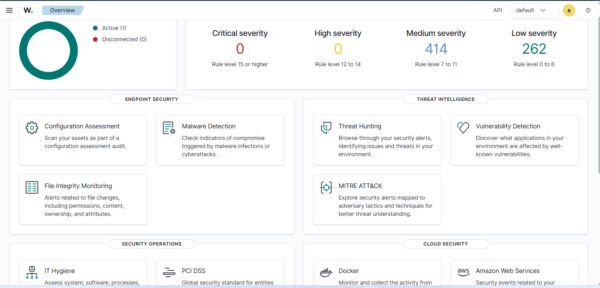
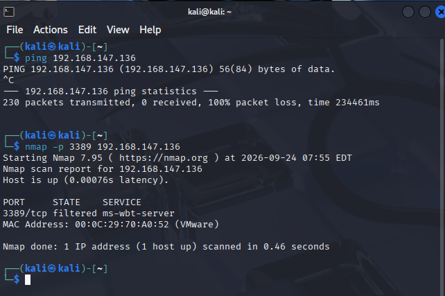
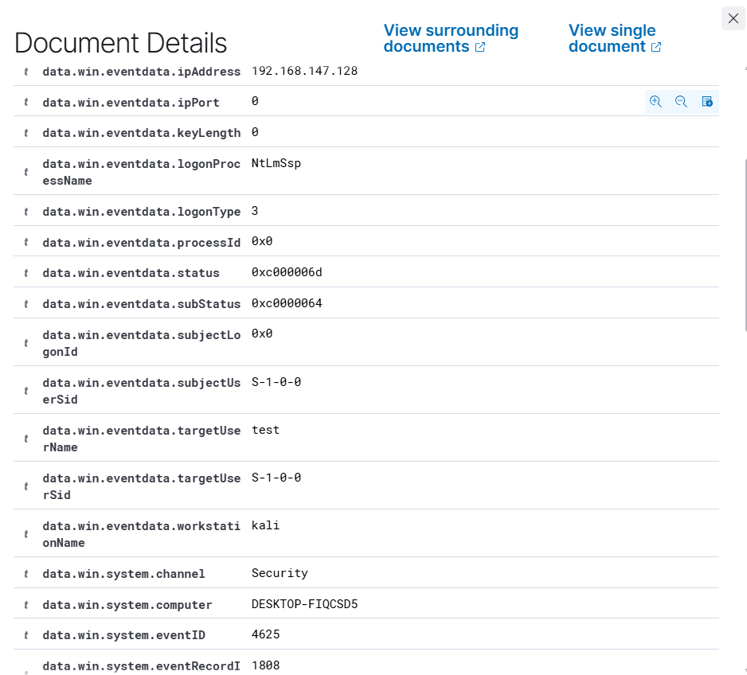
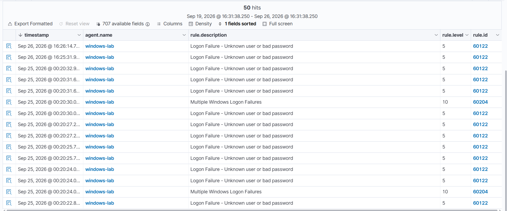
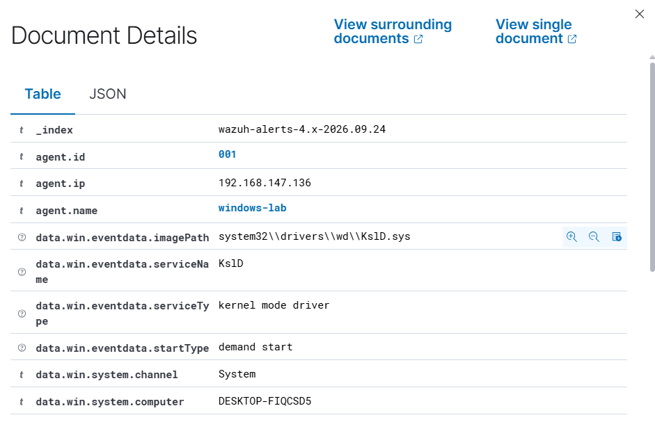

# Home SOC Lab: Detecting RDP Brute-Force Attempts with Wazuh

A hands-on blue-team lab built to practice the core workflow of a SOC Analyst: deploy a SIEM, generate real attack traffic, triage the alerts, and separate signal from noise.

## Lab Architecture

| Component | Role | Specs |
|---|---|---|
| Ubuntu Server 22.04 (VM) | Wazuh Manager + Indexer + Dashboard (all-in-one) | 4 vCPU, 4GB RAM |
| Windows 10 (VM) | Monitored endpoint (`windows-lab`) with Wazuh Agent | 4GB RAM |
| Kali Linux (VM) | Attack simulation source | 2GB RAM |

All three VMs run on VMware Workstation, isolated on a NAT virtual network.

## What I Did

1. **Deployed Wazuh** as a single-node manager and enrolled a Windows 10 agent, confirming live telemetry through the Threat Hunting (formerly "Security Events") module.

   
2. **Baselined normal activity** first — before hunting for attacks, I reviewed what routine Windows noise looks like (scheduled service checks, license validation, session events) so I could tell it apart from anything meaningful later.
3. **Simulated a local failed-logon attempt** directly on the Windows console and confirmed Wazuh logged it as `logonType: 2` (Interactive) with `ipAddress: 127.0.0.1` — expected, since the attempt originated from the machine itself. Rule ID `60122`, "Logon Failure - Unknown user or bad password."
4. **Simulated a remote brute-force attempt** from the Kali VM against the Windows RDP service (`xfreerdp`). Root-caused an initial `filtered` port state (via `nmap -p 3389`) to a Windows Firewall/network-profile issue, resolved it, then confirmed successful remote detection: `ipAddress: 192.168.147.128`, `workstationName: kali`, `logonType: 3` (Network) — Wazuh correctly attributed the failed logons to the real attacking host, not the local machine.

   

   

5. **Discovered a built-in correlation rule** (`rule.id 60204`, level 10, "Multiple Windows Logon Failures") that automatically escalated severity once repeated failed logons crossed a threshold within a short window — a working example of frequency-based detection, distinct from the single-event rule `60122`.

   
6. **Filtered out configuration-audit noise.** A `rule.level >= 7` search initially returned mostly CIS Windows 10 Benchmark (SCA module) findings — hardening recommendations, not live threats. Adding `NOT rule.groups:sca` isolated genuine security events from compliance baseline results, cutting 303 hits down to 46 relevant ones.
7. **Investigated a "New Windows Service Created" alert** by correlating its timestamp against my own actions, and inspected the driver load event for `KslD.sys`.

   

## Troubleshooting Note: Diagnosing a "Filtered" RDP Port

The first remote attempt from Kali returned `ERRCONNECT_CONNECT_FAILED`, and `nmap -p 3389` confirmed the port as `filtered` despite RDP appearing enabled in Windows Settings. Systematic elimination using `Test-NetConnection`, `Get-NetConnectionProfile`, and `Get-NetFirewallRule` ruled out the network profile and the built-in firewall rule state (both showed correctly configured) before the actual block was isolated and cleared — a realistic example of the layered troubleshooting a SOC/IT role regularly requires, separate from the detection work itself.

## Key Findings & Takeaways

- **Not every high-severity alert is an attack.** `rule.level` alone doesn't distinguish a hardening gap (SCA) from a live incident — `rule.groups` and the specific rule ID matter more for accurate triage.
- **`logonType` and `workstationName` are critical pivot fields.** They're what actually prove an attempt came from a remote host rather than the local console — far more reliable than assuming based on alert volume alone.
- **Built-in correlation rules can cover more ground than expected.** Before writing a custom rule, checking whether Wazuh's default ruleset already solves the problem (as `60204` did here) avoids duplicated effort.
- **Legitimate system components can carry real risk.** While investigating a driver-load event, I learned that `KslD.sys` — a genuine, Microsoft-signed Windows Defender kernel driver — is documented in the public [LOLDrivers](https://www.loldrivers.io/) project as an abusable "Living-Off-the-Land Driver" (BYOVD technique) used in credential-dumping research, because Microsoft ships both a patched and an older vulnerable copy side by side on disk. This is a useful reminder that "signed by Microsoft" isn't the same as "safe to ignore."

## Next Steps

- Write a custom Wazuh rule to detect a *successful* login immediately following a burst of failed attempts — a stronger compromise indicator than failed attempts alone.
- Add a second monitored endpoint and practice lateral-movement detection scenarios.

---
*Lab built and documented as part of independent SOC Analyst skill-building, alongside 70+ completed TryHackMe/HackTheBox rooms.*
